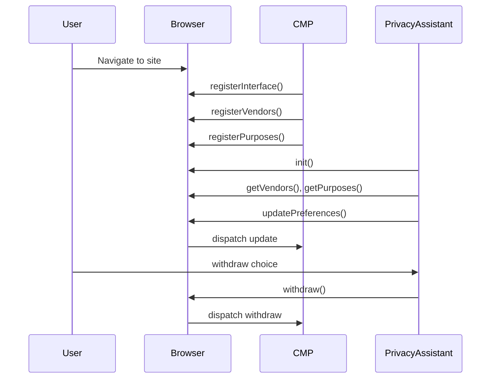
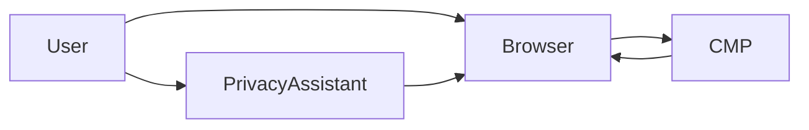

# RFC: `navigator.consent` Browser API for CMP and Privacy Assistant Interoperability

## Abstract

This Request for Comments (RFC) proposes a browser-level API, `navigator.consent`, to standardize interoperability between Consent Management Platforms (CMPs) and Privacy Assistant Software. The objective is to reduce consent fatigue while preserving specific, informed, and auditable consent choices. The API defines a neutral transport and coordination layer: CMPs remain responsible for compliance and auditability, while Privacy Assistant Software can help users express preferences in a consistent way.

## 1. Document Status

- **Status**: Draft for public technical review.
- **Audience**: Browser vendors, CMP providers, privacy-assistant developers, regulators, and standards bodies.
- **Normative language**: The keywords **MUST**, **MUST NOT**, **SHOULD**, and **MAY** in this document are to be interpreted as described in RFC 2119.
- **Draft-stage governance**: this draft uses light governance; the human repo owner has final decision authority, no fixed review window is required, and unresolved objections are tracked in `discussion.md` before final owner decision.

## 2. Scope

### 2.1 Goals

This specification aims to:

1. Define a consistent browser API for CMP and Privacy Assistant communication.
2. Preserve granular consent by purpose and vendor.
3. Reduce reverse-engineering of CMP interfaces by extensions.
4. Support auditability and regulatory compliance workflows.
5. Improve user experience by reducing repeated, low-value consent friction.

### 2.2 Non-Goals

This specification does not:

1. Replace CMP legal accountability or compliance obligations.
2. Define a single legal interpretation for all jurisdictions.
3. Mandate a single consent UX across all websites.
4. Define browser UI requirements (choice screens, browser-native dialogs).
5. Standardize advertising-specific taxonomies as the only model.
6. Define or enforce a canonical browser-side consent storage scope or persistence policy.

## 3. Terminology

### 3.1 Consent Management Platform (CMP)

A system integrated by a website or service to present consent information, collect user preferences, store evidence, and coordinate consent signals to downstream processors.

### 3.2 Vendor

A third-party or first-party processor identified in the consent scope (for example analytics, advertising, chat, media embed).

### 3.3 Purpose

A specific processing objective for which consent may be requested (for example analytics measurement, personalization, advertising).

### 3.4 Privacy Assistant Software

Software acting for the user (typically browser extensions) to read consent metadata and express user preferences programmatically.

### 3.5 DOM-Context Script

A script running in the page context (for example website scripts and CMP scripts).

### 3.6 Extension Context

A browser extension context authorized to invoke assistant-only API methods.

## 4. Regulatory Context (Informative)

This RFC is technical and neutral. It is designed to remain useful across jurisdictions. Current EU policy discussion includes the Digital Omnibus proposal (COM(2025)0837), which is proposal-stage and not final law. References to proposal-stage policy in this document are informative and must not be interpreted as adopted legal requirements. Detailed advocacy and policy-mapping materials are maintained separately from this RFC (for example `digital-omnibus-position-paper.md` and `site/policy.html`).

## 5. Architecture Overview

### 5.1 Actors

- User
- Browser
- CMP (DOM context)
- Privacy Assistant Software (extension context)

### 5.2 Design Principle

`navigator.consent` is a transport and coordination interface. It does not replace CMP responsibilities for transparency, legal basis presentation, consent scope selection, consent storage and persistence obligations, or auditability.

### 5.3 Permission Boundary

| Method group | DOM context | Extension context |
| --- | --- | --- |
| `registerInterface`, `registerVendors`, `registerPurposes`, `requestConsent` | MUST be allowed | MUST be rejected |
| `getVendors`, `getPurposes`, `hide`, `show`, `audit`, `init` | MUST be rejected | MUST be allowed |
| `getRegulations` | MUST be allowed | MUST be allowed |
| `setRegulations` | MUST be rejected | MUST be allowed |
| `updatePreferences`, `withdraw`, `addEventListener`, `removeEventListener` | MUST be allowed | MUST be allowed |

Rejected calls MUST throw `NotAllowedError`.

### 5.4 Consent Lifecycle States

1. `unregistered`
2. `registered`
3. `metadata_available`
4. `preferences_applied`
5. `withdrawn`

State transitions MUST be monotonic in event order for a given CMP registration.

### 5.5 Scope and Persistence Responsibility

- Consent scope policy (for example origin, domain, eTLD+1, path, or policy-defined variants) is determined by CMP logic.
- Consent persistence policy is determined by CMP logic.
- Browsers implementing this API MUST NOT reinterpret CMP scope policy into a mandatory global model.
- CMPs SHOULD synchronize already-collected effective preferences after registration via `updatePreferences()` so `navigator.consent` reflects current state before contextual flows.

### 5.6 Frame and Embedded Context Model

- Cross-origin iframes MAY register independently through `registerInterface()`.
- Browser MUST attach runtime provenance metadata (`topLevelOrigin`, `frameOrigin`, `scriptOrigin`) to audit records and related event payload metadata.
- For DOM-context mutating calls where `registrationId` is omitted, browser MUST resolve to the caller's own registration.
- DOM-context callers MUST NOT mutate registrations they do not own and MUST receive `NotAllowedError` for such attempts.
- Embedded contextual consent requests SHOULD be user-triggered (for example click on blocked functionality).

## 6. API Surface

### 6.1 Namespace

The namespace is `navigator.consent`.

If the feature is unavailable, callers MUST treat `navigator.consent` as absent and degrade gracefully.

### 6.2 General Conventions

1. All mutating methods SHOULD return `Promise`.
2. Payloads MUST be JSON-serializable.
3. Invalid payloads MUST throw `ValidationError`.
4. Methods targeting unknown registrations MUST throw `NotFoundError`.
5. Conflicting updates in the same state window MAY throw `ConflictError`.
6. Browser MUST derive authoritative mutation provenance (`user`, `cmp`, `privacy_assistant`) from runtime context and user-activation signals.
7. Caller-provided `source` values, if present in payloads, MUST be treated as non-authoritative hints and MUST NOT override runtime-derived provenance.
8. Implementations MUST enforce anti-spam controls including registration quotas, payload caps, mutation rate limits, and bounded operational audit retention.
9. Calls blocked by anti-spam controls MUST return machine-readable errors and SHOULD produce auditable warning records with provenance metadata.

### 6.3 Common Types (Illustrative)

```ts
type ConsentDecision = "grant" | "deny" | "unset";
type ConsentEventType = "update" | "hide" | "show" | "withdraw" | "audit" | "init" | "regulation_change" | "consent_request";
type LegalBasis = "consent" | "legitimate_interest";

interface InterfaceRegistration {
  vendor: string;
  prompt?: string;
  regulation?: string;
  jurisdiction?: string;
  versionIdentifier: string;
  cmpId?: string;
}

interface Vendor {
  id: string;
  name: string;
  domain: string;
  privacyPolicyUrl: string;
  purposeIds?: string[];
  additionalIDs?: Record<string, string>;
  description?: string;
}

interface Purpose {
  id: string;
  name: string;
  legalBasis?: LegalBasis;
  additionalIDs?: Record<string, string>;
  description?: string;
}

interface RegulationInfo {
  regulations: string[];
  jurisdiction: string | null;
  source: "browser" | "privacy_assistant" | "user";
  browserDefault: {
    regulations: string[];
    jurisdiction: string | null;
  } | null;
}

interface PreferenceUpdate {
  registrationId?: string;
  domain?: string;
  vendors?: Record<string, ConsentDecision>;
  purposes?: Record<string, ConsentDecision>;
  source?: "cmp" | "privacy_assistant" | "user";
  reason?: string;
}

interface ConsentSnapshot {
  registrationId: string;
  domain: string;
  vendors: Record<string, ConsentDecision>;
  purposes: Record<string, ConsentDecision>;
  updatedAt: string;
}
```

Notes:

- `domain` fields in this RFC represent contextual metadata and are not a normative browser scope policy.
- `legalBasis` on `Purpose`, `regulation`, and `jurisdiction` provide optional interoperability metadata; policy interpretation for these fields is documented in separate policy materials, not as normative RFC requirements.

### 6.4 Methods for CMPs (DOM Context)

#### 6.4.1 `navigator.consent.registerInterface()`

```ts
registerInterface(payload: InterfaceRegistration): Promise<{ registrationId: string }>
```

Behavior:

- Registers a consent interface declaration for the current page context.
- Browser returns `registrationId`, which identifies subsequent metadata and preference operations.
- `registrationId` identifies a coordination boundary and is not a normative declaration of CMP storage scope policy.
- Registration ownership is bound to runtime context provenance.
- Registration is intentionally open and MUST NOT depend on browser-side trust attestation or allow-lists.
- Re-registration with the same `cmpId` MAY update existing metadata and SHOULD keep audit continuity.
- Browser MUST append an audit entry for each registration and registration update.
- Browser MUST attach provenance metadata generated by the runtime (for example origin and frame information), not supplied by page scripts.

Errors:

- `ValidationError`, `ConflictError`

#### 6.4.2 `navigator.consent.registerVendors()`

```ts
registerVendors(vendors: Vendor[], options?: { registrationId?: string }): Promise<{ count: number }>
```

Behavior:

- Associates vendors with a CMP registration.
- Each vendor entry MUST include free-form `id`, readable label `name`, `domain`, and `privacyPolicyUrl`.
- Vendor `purposeIds` MAY be provided to declare which registered purposes the vendor processes data under.
- Vendor `additionalIDs` MAY be provided as `Record<string, string>` to map to external identifier systems.
- If `registrationId` is omitted, the browser SHOULD resolve it to the caller CMP registration.

Errors:

- `NotFoundError`, `ValidationError`

#### 6.4.3 `navigator.consent.registerPurposes()`

```ts
registerPurposes(purposes: Purpose[], options?: { registrationId?: string }): Promise<{ count: number }>
```

Behavior:

- Associates purposes with a CMP registration.
- Each purpose entry MUST include free-form `id` and readable label `name`.
- Purpose `legalBasis` MAY be provided to declare the legal basis for the processing purpose. If provided, values MUST use the closed vocabulary defined by `LegalBasis`.
- Purpose `additionalIDs` MAY be provided as `Record<string, string>` to map to external identifier systems.
- If `registrationId` is omitted, browser SHOULD resolve to caller registration.

Errors:

- `NotFoundError`, `ValidationError`

#### 6.4.4 `navigator.consent.requestConsent()`

```ts
requestConsent(request: {
  registrationId?: string;
  vendorIds?: string[];
  purposeIds?: string[];
  reason?: string;
}): Promise<ConsentSnapshot>
```

Behavior:

- Signals a consent request from the CMP. The request scope determines the semantics:
  - **Contextual request** (non-empty `vendorIds` or `purposeIds`): a specific vendor/purpose scope is required to continue a user flow. CMP SHOULD invoke this from a user-triggered interaction tied to blocked functionality (for example placeholder click on blocked embed content).
  - **General prompt** (empty or omitted `vendorIds` and `purposeIds`): the CMP is about to show its general consent UI (for example first-visit banner) and signals the assistant to handle it first. CMP SHOULD invoke this before rendering its own consent UI to give the assistant an opportunity to apply user preferences.
- Browser MUST emit a `consent_request` event with the request payload (including scope and `registrationId`) to notify active Privacy Assistant Software.
- Privacy Assistant Software MAY respond by applying `updatePreferences()` and MAY present assistant-side UI for explicit user input.
- Browser SHOULD resolve promptly and MUST NOT require assistant availability for completion.
- The returned `ConsentSnapshot` MUST reflect the latest available state at resolution time and is not guaranteed to represent finalized consent for the requested scope.
- If requested scope remains denied or unset after this call, CMP MAY continue by presenting CMP-side consent UI and collecting explicit user decision.

Errors:

- `ValidationError`, `NotFoundError`, `StateError`

#### 6.4.5 `navigator.consent.updatePreferences()`

```ts
updatePreferences(update: PreferenceUpdate): Promise<ConsentSnapshot>
```

Behavior:

- Persists preference updates from CMP-side collection and synchronization flows.
- CMP MAY call this method immediately after registration to synchronize already-collected effective preferences.
- If `registrationId` is omitted in DOM context, browser MUST resolve to caller registration.
- DOM-context callers MUST NOT update registrations they do not own.
- Browser MUST apply incoming preference updates without redefining CMP scope or persistence policy.
- Browser MUST dispatch an `update` event after successful write.
- Browser MUST apply provenance-aware conflict rules defined in Section 7.3.

Errors:

- `ValidationError`, `ConflictError`

#### 6.4.6 `navigator.consent.withdraw()`

```ts
withdraw(scope?: {
  registrationId?: string;
  vendorIds?: string[];
  purposeIds?: string[];
  reason?: string;
}): Promise<ConsentSnapshot>
```

Behavior:

- Withdraws previously recorded consent in scope.
- If `registrationId` is omitted in DOM context, browser MUST resolve to caller registration.
- DOM-context callers MUST NOT withdraw registrations they do not own.
- Browser MUST dispatch a `withdraw` event.

Errors:

- `ValidationError`, `NotFoundError`

### 6.5 Methods for Privacy Assistant Software (Extension Context)

#### 6.5.1 `navigator.consent.getVendors()`

```ts
getVendors(filter?: { registrationId?: string; domain?: string }): Promise<Vendor[]>
```

Behavior:

- Returns vendors registered by CMPs.
- If no filter is provided, returns aggregated vendors for current page context.

#### 6.5.2 `navigator.consent.getPurposes()`

```ts
getPurposes(filter?: { registrationId?: string; domain?: string }): Promise<Purpose[]>
```

Behavior:

- Returns purposes registered by CMPs.
- If no filter is provided, returns aggregated purposes for current page context.

#### 6.5.3 `navigator.consent.updatePreferences()`

```ts
updatePreferences(update: PreferenceUpdate): Promise<ConsentSnapshot>
```

Behavior:

- Writes preference updates from assistant-side logic.
- Browser MUST dispatch an `update` event after successful write.
- Browser MUST apply provenance-aware conflict rules defined in Section 7.3.

#### 6.5.4 `navigator.consent.hide()`

```ts
hide(target?: { registrationId?: string; reason?: string }): Promise<void>
```

Behavior:

- Requests CMP UI suppression in scope.
- Privacy Assistant Software MAY invoke `hide()` proactively (including automated flows); this draft does not require user-activation gating for `hide()`.
- `hide()` / `show()` calls MUST remain auditable and provenance-attributed.
- `show()` is the recovery path to re-open CMP UI when needed.
- `hide()` coordinates UI signaling only and does not transfer CMP legal/compliance accountability.
- Browser MUST dispatch `hide`.

#### 6.5.5 `navigator.consent.show()`

```ts
show(target?: { registrationId?: string; reason?: string }): Promise<void>
```

Behavior:

- Requests CMP UI presentation in scope.
- `show()` SHOULD be available as an explicit recovery/re-open action after prior suppression.
- Browser MUST dispatch `show`.

#### 6.5.6 `navigator.consent.withdraw()`

```ts
withdraw(scope?: {
  registrationId?: string;
  vendorIds?: string[];
  purposeIds?: string[];
  reason?: string;
}): Promise<ConsentSnapshot>
```

Behavior:

- Requests withdrawal of consent through assistant action.
- Browser MUST dispatch `withdraw`.

#### 6.5.7 `navigator.consent.audit()`

```ts
audit(query?: {
  registrationId?: string;
  from?: string;
  to?: string;
  limit?: number;
}): Promise<ConsentAuditRecord[]>
```

Behavior:

- Returns consent audit records available in the current context and permissions.

#### 6.5.8 `navigator.consent.init()`

```ts
init(metadata?: {
  assistantId?: string;
  version?: string;
  displayName?: string;
}): Promise<void>
```

Behavior:

- Signals that a Privacy Assistant is active.
- Browser MUST dispatch `init`.

### 6.6 Event API

#### 6.6.1 Listener Methods

```ts
addEventListener(type: ConsentEventType, listener: (event: ConsentEvent) => void): void;
removeEventListener(type: ConsentEventType, listener: (event: ConsentEvent) => void): void;
```

#### 6.6.2 Event Object

```ts
interface ConsentEvent {
  type: ConsentEventType;
  timestamp: string;
  registrationId?: string;
  domain?: string;
  source?: "cmp" | "privacy_assistant" | "browser" | "user";
  payload?: unknown;
}
```

#### 6.6.3 Event Ordering Requirements

For a single registration:

1. `init` (if emitted) MUST precede assistant-driven updates.
2. `update` MUST be emitted after a successful preference write.
3. `withdraw` MUST be emitted after successful withdrawal.
4. `hide` and `show` events MUST preserve invocation order.
5. `regulation_change` MUST be emitted after a successful `setRegulations()` call and MUST be delivered before any subsequent `getRegulations()` call resolves the updated value.
6. `consent_request` MUST be emitted when `requestConsent()` is called, before the returned Promise resolves.

### 6.7 Regulation Context Methods

#### 6.7.1 `navigator.consent.getRegulations()`

```ts
getRegulations(): Promise<RegulationInfo>
```

Behavior:

- Returns the current regulation context for the page.
- This method is shared: both DOM context and extension context MUST be allowed to call it.
- If the browser has not determined a regulation context, MUST return `RegulationInfo` with `regulations: []`, `jurisdiction: null`, `source: "browser"`, and `browserDefault: null`.
- If a privacy assistant has overridden the regulation via `setRegulations()`, the returned `source` MUST be `"privacy_assistant"` and `browserDefault` MUST contain the browser's original detection.
- If the user has set a regulation preference through browser settings, `source` MUST be `"user"`.

#### 6.7.2 `navigator.consent.setRegulations()`

```ts
setRegulations(options: {
  regulations?: string[];
  jurisdiction?: string | null;
}): Promise<RegulationInfo>
```

Behavior:

- Overrides the browser-detected regulation context.
- This method is extension-only: DOM-context calls MUST throw `NotAllowedError`.
- Partial updates are supported: omitting a field leaves its current override value unchanged.
- Setting `regulations` to `[]` and `jurisdiction` to `null` clears the override and reverts to browser default.
- Browser MUST preserve the original browser-detected values in `browserDefault` for transparency.
- Browser MUST emit a `regulation_change` event after a successful override or clear.
- Browser MUST append an audit record for each `setRegulations()` call.
- The returned `RegulationInfo` reflects the state after the update.

Errors:

- `NotAllowedError`, `ValidationError`

Note: The `regulation` and `jurisdiction` fields on `InterfaceRegistration` (Section 6.4.1) represent what the CMP declares it operates under. The `getRegulations()` method returns what the browser or assistant believes applies to the current user. A mismatch between these values is informational and does not constitute a hard error; CMPs SHOULD listen for `regulation_change` events to adapt their behavior when the regulation context changes.

## 7. Multi-CMP and Conflict Handling

### 7.1 Registration Isolation

- Each `registerInterface` call yields one logical registration boundary.
- Vendor and purpose catalogs are attached to that boundary.
- Cross-origin iframe registrations are allowed but remain isolated by registration ownership and provenance metadata.
- DOM-context callers can mutate only their own registrations.

### 7.2 Aggregated Queries

- `getVendors()` and `getPurposes()` without filter MAY aggregate across active registrations.
- Aggregation SHOULD preserve source mapping (`registrationId`) in event payloads or record metadata.

### 7.3 Conflict Resolution

If multiple updates target the same key (`vendorId` or `purposeId`) concurrently:

1. Browser MUST resolve updates using authoritative provenance metadata (`user`, `cmp`, `privacy_assistant`) derived at runtime.
2. Updates with `user` provenance MUST take precedence over `cmp` and `privacy_assistant` updates for the same key.
3. Once a key has a `user`-provenance value, later `cmp` or `privacy_assistant` updates for that key MUST NOT override it.
4. A later `user`-provenance update MAY override any previous value for that key.
5. For conflicts between `cmp` and `privacy_assistant` where no `user`-provenance value exists, browser SHOULD apply deterministic timestamp ordering (last-write-wins).
6. Browser SHOULD include applied and blocked conflict outcomes (with provenance metadata) in audit records.
7. Browser MAY reject non-deterministic updates with `ConflictError`.
8. This RFC does not mandate persistence duration for consent choices; persistence remains CMP-managed policy.

## 8. Minimum Conformance Profile (Draft Stage)

A conformant draft-stage implementation of `navigator.consent` MUST implement and enforce the core MUST requirements already defined in this RFC, including:

- Permission boundary and context rejection behavior (Section 5.3).
- Runtime-derived authoritative provenance and non-authoritative caller `source` handling (Section 6.2).
- Core method and event semantics defined with MUST requirements in Section 6.
- Provenance-aware conflict handling requirements (Section 7.3).
- Anti-spam control requirements and machine-readable rejection behavior (Sections 6.2 and 10.6).
- Required vendor/purpose declaration fields in registration flows (Section 6.4.2 and Section 6.4.3).

SHOULD-level guidance remains recommended but is not required for draft-stage conformance.

## 9. Error Model

Implementations SHOULD provide machine-readable errors:

```ts
interface ConsentError {
  name:
    | "NotAllowedError"
    | "ValidationError"
    | "NotFoundError"
    | "ConflictError"
    | "StateError"
    | "RateLimitError";
  message: string;
  code: string;
  details?: Record<string, unknown>;
}
```

Anti-spam rejection guidance:

- Registration quota and rate-limit violations SHOULD use `RateLimitError`.
- Oversized payload violations SHOULD use `ValidationError` with code `PAYLOAD_TOO_LARGE`.
- `details` SHOULD include the violated control category and applicable scope identifiers (`topLevelOrigin`, `frameOrigin`, `registrationId`) when available.

## 10. Security and Privacy Considerations

### 10.1 Threat Model (Non-Exhaustive)

1. Unauthorized invocation of assistant-only methods from DOM context.
2. Payload tampering or schema abuse.
3. Event spoofing and replay.
4. Excessive call volume, registration spam, and oversized payloads causing resource exhaustion.
5. Cross-context leakage of sensitive preference data.

### 10.2 Required Controls

Implementations MUST:

1. Enforce strict context checks for method access.
2. Validate payloads against declared schemas and enforce payload size/count limits before mutation.
3. Enforce registration quotas for repeated registrations, including embedded context scenarios.
4. Apply mutation rate limits on high-frequency write operations.
5. Keep bounded operational audit retention and bounded `audit()` response windows to prevent unbounded runtime growth.
6. Emit auditable metadata for preference mutations and withdrawals.
7. Emit auditable warning records for anti-spam rejections with reason codes and provenance metadata.
8. Prevent unauthorized cross-origin data disclosure.

Implementations SHOULD:

1. Minimize retained personal data.
2. Retain only necessary audit fields for compliance evidence.
3. Expose clear user-level withdrawal and reset flows.
4. Publish implementation-defined anti-spam limits for integrator predictability.

### 10.3 Data Handling

- Data at rest and in transit SHOULD use platform best-practice protections.
- Access to audit data SHOULD be scoped to authorized contexts and permissions.

### 10.4 Transparency-First Trust Model

- This specification intentionally uses an open registration model and does not require DRM-like trust gates for declaration.
- Trust is expected to emerge from transparent, inspectable audit history over time.
- Browsers SHOULD expose a dedicated DevTools panel for consent declarations and audit timeline.
- This panel SHOULD display declared data only (registration payloads, declared vendors/purposes, preference updates, withdrawals, provenance metadata) and SHOULD NOT duplicate observed traffic/storage signals already available in other DevTools panels.

### 10.5 Mismatch Handling and User Safety

- If a Privacy Assistant detects undeclared or inconsistent declarations, default behavior SHOULD be to warn.
- This RFC defines a single-level warning model in v1 (`warn` only) and does not define multi-level severity taxonomy.
- Implementations SHOULD use warning `kind` and `reasonCode` for categorization and filtering behavior.
- Assistants MUST NOT hard-block solely on mismatch detection in this v1 draft, because detection can produce false positives and break critical user journeys.

### 10.6 Anti-Spam Control Profile (Balanced)

- This RFC adopts a balanced anti-spam profile for open-registration deployments.
- Implementations MUST provide controls across five categories:
  1. Registration quotas (per top-level context and per frame context).
  2. Payload caps for registration and mutation payloads.
  3. Mutation rate limits for write-heavy methods.
  4. Bounded operational audit retention and bounded `audit()` response windows.
  5. Abuse observability via reason-coded warnings with provenance metadata.
- Re-registration with the same `cmpId` SHOULD update an existing registration instead of consuming a new quota slot.
- This section defines operational protection requirements and does not define long-term audit export/retention policy.

## 11. Machine-Readable Artifacts

This RFC is paired with the following schema files:

- `schemas/cmp.schema.json`
- `schemas/vendor.schema.json`
- `schemas/purpose.schema.json`
- `schemas/preferences.schema.json`
- `schemas/event.schema.json`
- `schemas/consent-record.schema.json`
- `schemas/regulation-info.schema.json`

Schema files are normative for payload structure once published with this RFC.

Draft-stage schema evolution policy:

- This RFC follows a lightweight draft-stage approach: schema changes SHOULD be additive and backward-compatible by default.
- This draft does not define runtime schema negotiation fields.
- If a breaking schema change is required, editors MUST announce it explicitly in changelog/release notes and publish a new schema line/path at that time.
- More formal compatibility governance is deferred to CR/interoperability phase.

## 12. Use Cases

### 12.1 Standard Website Visit with Privacy Assistant

1. CMP registers its interface, vendors, and purposes.
2. CMP synchronizes already-collected effective preferences via `updatePreferences()` when available.
3. Privacy Assistant initializes and fetches metadata.
4. Assistant applies user preferences as needed.
5. Browser dispatches `update`.
6. CMP updates downstream signaling and keeps audit evidence.

### 12.2 New Vendor Introduced Mid-Session

1. CMP updates vendor catalog.
2. CMP requests consent for new scope.
3. Assistant applies per-vendor decision.
4. Browser dispatches `update` for that scope only.

### 12.3 Consent Withdrawal

1. User requests withdrawal via assistant or CMP.
2. `withdraw` event is emitted.
3. Updated snapshot and audit record are available.

## 13. Implementation and Rollout Guidance

1. Start with shim/polyfill experimentation to validate contracts.
2. Run browser-extension pilots with multiple CMP providers.
3. Evaluate interoperability with non-advertising use cases (commerce, SaaS, media, public services).
4. Contribute findings to standardization discussions.

## 14. Conclusion

`navigator.consent` offers a practical interoperability layer for consent management without centralizing consent logic in a single actor. By defining clear contracts, context boundaries, event semantics, and auditable flows, this RFC supports user-centric privacy tooling and compliance-ready CMP integration.

## Appendix A: Interaction Diagram



## Appendix B: Component Diagram



## Appendix C: Non-Normative Regulation Identifier Registry

This appendix provides a non-normative registry of well-known regulation identifiers for use with `getRegulations()`, `setRegulations()`, and the `regulation` field on `InterfaceRegistration`. Identifiers are lowercase strings. Jurisdiction codes follow ISO 3166-1 alpha-2 or ISO 3166-2.

| Identifier | Full Name | Typical Jurisdictions |
| --- | --- | --- |
| `gdpr` | General Data Protection Regulation | EU/EEA member states (`DE`, `FR`, `IT`, etc.) |
| `eprivacy` | ePrivacy Directive (2002/58/EC) | EU/EEA member states |
| `ccpa` | California Consumer Privacy Act / CPRA | `US-CA` |
| `lgpd` | Lei Geral de Proteção de Dados | `BR` |
| `pipeda` | Personal Information Protection and Electronic Documents Act | `CA` |
| `pipl` | Personal Information Protection Law | `CN` |
| `popia` | Protection of Personal Information Act | `ZA` |
| `pdpa_th` | Personal Data Protection Act (Thailand) | `TH` |
| `appi` | Act on the Protection of Personal Information | `JP` |
| `dpa_uk` | Data Protection Act 2018 / UK GDPR | `GB` |

This registry is informational. Implementations MAY support additional identifiers. The registry is expected to evolve as new regulations emerge.
